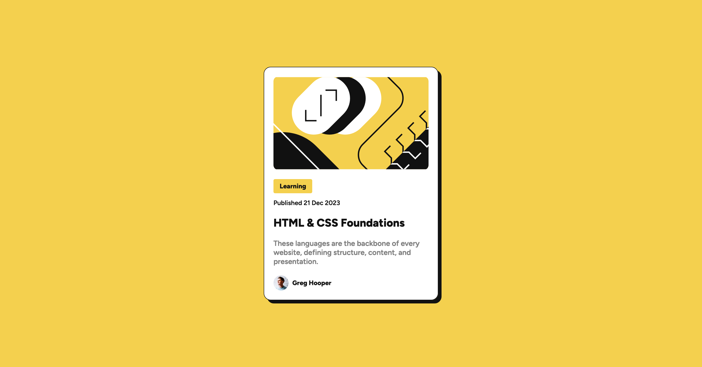

# Frontend Mentor - Blog preview card solution

This is a solution to the [Blog preview card challenge on Frontend Mentor](https://www.frontendmentor.io/challenges/blog-preview-card-ckPaj01IcS). Frontend Mentor challenges help you improve your coding skills by building realistic projects. 

## Table of contents

- [Overview](#overview)
  - [The challenge](#the-challenge)
  - [Screenshot](#screenshot)
  - [Links](#links)
- [My process](#my-process)
  - [Built with](#built-with)
  - [What I learned](#what-i-learned)
  - [Continued development](#continued-development)
  - [Useful resources](#useful-resources)
- [Author](#author)

## Overview

### The challenge

Build an accurate and responsive version of the given design.

### Screenshot

### Links

- Solution URL: [Github repo](https://github.com/nicholasboyce/blog-preview-card)
- Live Site URL: [Github pages](https://nicholasboyce.github.io/blog-preview-card/)

## My process

### Built with

- Semantic HTML5 markup
- CSS custom properties
- Flexbox
- CSS Grid

### What I learned

I normally stick to flexbox because I'm more comfortable with it, but CSS Grid is really handy for defining the sizes of things without having to deal with "flex: 1" and all that. It's especially handy for pictures. I like it! And want to use it more going forward.

### Continued development

I'm really looking forward to creating easily customizable color palettes. Maybe users could even adjust how they want their page to look based on presets on one of my websites in the future!

### Useful resources

- [Why I thought of using Grid this way](https://youtu.be/aKFB5Bjk6KM?si=ZFjqB-FVYsuhG6Cz) 
- [I organized my CSS file like this](https://github.com/nicholasboyce/faq-accordion) 

## Author

- Frontend Mentor - [@nicholasboyce](https://www.frontendmentor.io/profile/nicholasboyce)
